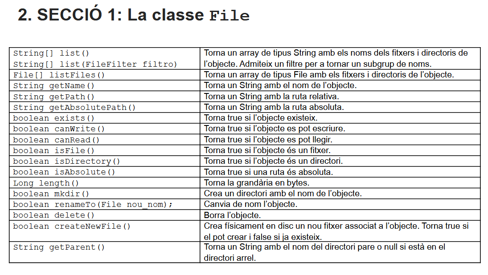
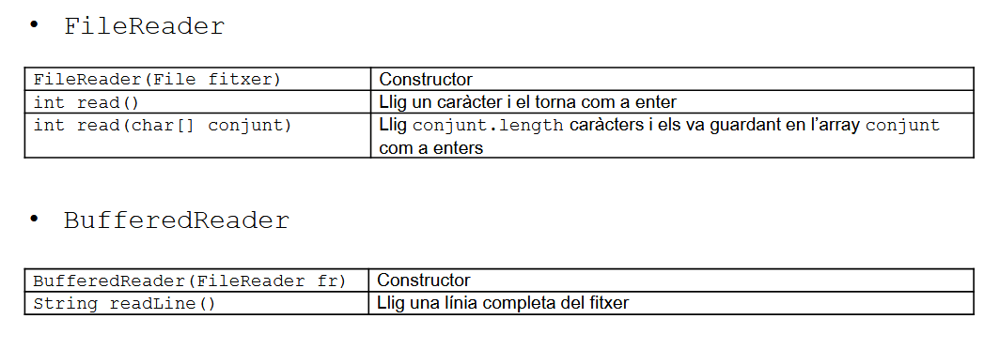
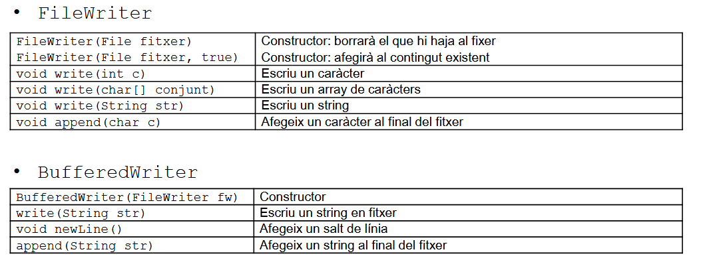

## Ejercicios de clase dia 18-09-2025
```java
package WorkSpaceDatos;

import java.io.*;

public class Ejemplo1 {
    public static void main(String[] args) {
        File fichero = new File("pitodani.txt");

        System.out.println("nombre fichero: " + fichero.getName());
        System.out.println("ruta: " + fichero.getPath());
        System.out.println("ruta absoluta: " + fichero.getAbsolutePath());
        System.out.println("se puede leer: " + fichero.canRead());
        System.out.println("se puede escribir: " + fichero.canWrite());
        System.out.println("tamaño: " + fichero.length());

        File directorio = new File(".");
        String[] listaArchivos  = directorio.list();
        System.out.println("Lista de directorios: " + directorio.getName());

        for (int i = 0; i < listaArchivos.length; i++) {
            System.out.println(listaArchivos[i]);
        }

        for (String s: listaArchivos) {
            System.out.println(s);
        }

        String strdir = args[0];
        System.out.println(strdir);
        File dir = new File(strdir);
        FiltroExtension extension = new FiltroExtension(".txt");
        String[] listaArchivos2 = dir.list(extension);
        for (int i = 0; i < listaArchivos2.length; i++) {
            System.out.println(listaArchivos2[i]);
        }
    }
}

```

## Apuntes Tema 1 Ficheros
### Teoria Tema 1

> metodos de la clase File


> para la lectura de caracteres (16 bits)


> para la escritura de caracteres (16 bits)

#### Sección 1 Tema 1

```java
package Tema1Ejercicios1;

import java.io.File;

public class Seccion1ejecs1to5 {
    public static void main(String[] args) {
        //ejec1 - Realitza un programa que reba com a paràmetre d’entrada un string amb un directori i
        //mostre el string per pantalla.
        File directorio = new File("."); //clase File, el directorio es el que se le pasa por new File
        System.out.println(directorio); //print de la ruta

        //ejec2 - Ampliar el programa anterior (crea una altra aplicació) per tal que mostre totes les
        //característiques d’interés del directori, prenent com a referència la informació que
        //proporciona la classe File
        System.out.println(directorio.getName()); //nombre
        System.out.println(directorio.getPath()); //ruta
        System.out.println(directorio.getAbsolutePath()); //ruta absoluta
        System.out.println(directorio.canRead()); //permisos de lectura
        System.out.println(directorio.canWrite()); // ** de escritura
        System.out.println(directorio.isFile()); //si es archivo .isDirectory si es directorio
        System.out.println(directorio.length()); //tamaño

        //ejec3 - Introduir una comprovació en el programa anterior (crea una altra aplicació) per determinar
        //si el directori existeix.
        System.out.println(directorio.exists());

        //ejec4 - Realitzar un programa que donat un directori, comprove si existeix i torne un missatge de
        //confirmació si existeix o una alerta en cas contrari.
        if (directorio.exists()) {
            System.out.println("directorio existe");
        } else {
            System.out.println("directorio no existe");
        }

        //ejec5 - Realitza un programa que reba com a paràmetres d’entrada un directori i una extensió de
        //fitxer (per exemple .txt) i torne per pantalla tots els fitxers del directori que complisquen el
        //criteri.
        String strdir = args[0];
        System.out.println(strdir);
        File dir = new File(strdir);
        FiltroExtension extension = new FiltroExtension(".txt");
        String[] listaArchivos = dir.list(extension);
        for (int i = 0; i < listaArchivos.length; i++) {
            System.out.println(listaArchivos[i]);
        }
    }
}
```

```java
package Tema1Ejercicios1;

import java.io.File;
import java.util.Scanner;

public class Seccion1ejec6 {
    public static void main(String[] args) {
        //ejec 6 - Modifica el programa anterior (crea una altra aplicació) per que tinga en compte que si no
        //se li passa ninguna extensió com a paràmetre, mostre tot el contingut del directori.
        String direc = args[0]; //se pasa la ruta del directorio por parametro
        File dir = new File(direc); //y se crea un nuevo manejador de archivo de ese directorio (manejador NO creador)
        String extension = ""; //se llama a la extension
        if (args.length > 1) { //comprobamos a traves de los argumentos si le hemos pasado mas de 1 argumento por parametro
            extension = args[1]; //en caso true, asignamos el nuevo argumento
            System.out.println("Listando archivos con extensión '" + extension + "':");
        } else {
            //en caso false listamos todo
            System.out.println("Listando archivos con extensión por defecto:");
        }

        FiltroExtension filtro = new FiltroExtension(extension); //clase externa
        String[] listaArchivos = dir.list(filtro); //array de strings que son el contenido de dir
        if (listaArchivos != null && listaArchivos.length > 0) {
            for (String archivo : listaArchivos) {
                System.out.println(archivo); //por cada string archivo en la listaArchivos, se printean en la terminal
            }
        } else {
            System.out.println("No se encontraron archivos con la extensión especificada o el directorio está vacío.");
        }
    }
}
```

```java
package Tema1Ejercicios1;

import java.io.File;
import java.util.Arrays;
import java.util.Scanner;

public class Seccion1ejec7 {
    public static void main(String[] args) {
        //ejec 7 - Modifica el programa anterior (crea una altra aplicació) per tal que admeta com a
        //paràmetres d’entrada un nombre qualsevol d’extensions, tornant després per pantalla tots
        //els fitxers del directori que tinguen alguna de les extensions indicades.
        String direc = args[0]; 
        File dir = new File(direc);
        String extension = "";
        if (args.length > 1) {
            for (int i = 1; i < args.length; i++) { //la unica diferencia con el anterior es que como sabemos que le vamos pasando extensiones
                extension = args[i];                //estos se van creando a medida que veamos los que le hemos pasado
                System.out.println("Listando archivos con extensión '" + extension + "':");
                ListarArchivos(dir, extension);
            }
        } else {
            System.out.println("Listando archivos con extensión por defecto:");
            ListarArchivos(dir, extension);
        }
    }

    //lo convertimos en una funcion ya que lo usamos varias veces, pasandole directorio y extensiones/extension
    public static void ListarArchivos(File dir, String extension) {
        FiltroExtension filtro = new FiltroExtension(extension);
        String[] listaArchivos = dir.list(filtro);
        if (listaArchivos != null && listaArchivos.length > 0) {
            for (String archivo : listaArchivos) {
                System.out.println(archivo);
            }
        } else {
            System.out.println("No se encontraron archivos con la extensión especificada o el directorio está vacío.");
        }
    }
}
```

```java
package Tema1Ejercicios1;

import java.io.File;
import java.io.IOException;
import java.nio.file.Files;

public class Seccion1ejec8 {
    public static void main(String[] args) {
        //ejec 8 - Desenvolupa un programa que donat un fitxer, realitze una còpia del mateix (en el mateix
        //directori i canviant-li el nom) i el borre després. Mostra una traça per pantalla de les accions
        //per a veure que es realitzen.
        String fich = args[0]; //fichero por parametro
        File fichero = new File(fich); //manejador de fichero
        File ficheroRenombrado = new File(fich + "Renombrado"); //manejador de nuevofichero

        if (fichero.exists()) { //si existe
            System.out.println("Existe el archivo " + fichero); //lo decimos
            System.out.println("copiando en directorio origen " + fichero.getParent()); //y lo copiamos en el mismo directorio
            try {
                Files.copy(fichero.toPath(), ficheroRenombrado.toPath()); //copia de origen a destino
            } catch (IOException e) {
                throw new RuntimeException(e);
            }
            if (ficheroRenombrado.renameTo(fichero)) { //cambiar el nombre de fichero a el nombre que ficheroRenombrado tiene con renameTo()
                System.out.println("Fichero renombrado copiado");
                System.out.println("eliminando fichero copiado y renombrado");
                if (ficheroRenombrado.delete()) { //delete() para eliminar
                    System.out.println("Fichero renombrado eliminado");
                } else {
                    System.out.println("Fichero renombrado no eliminado");
                }
            } else {
                System.out.println("Fichero renombrado no copiado");
            }
        } else {
            System.out.println("NO Existe el archivo " + fichero);
        }
    }

    //se queda igual
    public static void ListarArchivos(File dir, String extension) {
        FiltroExtension filtro = new FiltroExtension(extension);
        String[] listaArchivos = dir.list(filtro);
        if (listaArchivos != null && listaArchivos.length > 0) {
            for (String archivo : listaArchivos) {
                System.out.println(archivo);
            }
        } else {
            System.out.println("No se encontraron archivos con la extensión especificada o el directorio está vacío.");
        }
    }
}
```

##### Proyecto de Seccion 1 Tema 1
```java
package Tema1Proyecto;

import java.io.File;
import java.io.IOException;
import java.nio.file.Files;
import java.nio.file.Path;
import java.nio.file.Paths;
import java.nio.file.attribute.FileTime;
import java.util.Scanner;

public class proyecto {
    public static void main(String[] args) {
        //poner ruta como argumento 0 y hacer un File nuevo
        String ruta = args[0];
        File archivo = new File(ruta);
        //scanner para el menu
        Scanner sc = new Scanner(System.in);
        int opcion;
        do {
            menu();
            System.out.println("Escoga opción");
            opcion = sc.nextInt();
            switch (opcion) {
                case 0:
                    System.out.println("Saliendo del programa :D");
                    break;
                case 1:
                    getInformacion(archivo);
                    break;
                case 2:
                    crearCarpeta(archivo);
                    break;
                case 3:
                    crearFitxer(archivo);
                    break;
                case 4:
                    elimina(archivo);
                    break;
                case 5:
                    renomena(archivo);
                    break;
                default:
                    System.out.println("Opcion no valida");
                    break;
            }
        } while (opcion != 0);
    }

    public static void menu() {
        //display de las opciones
        System.out.println("======Gestor Archivos Albux=====");
        System.out.println("(0). Salir");
        System.out.println("(1). Obtener información");
        System.out.println("(2). Crear Carpeta en ruta");
        System.out.println("(3). Crear fichero en ruta");
        System.out.println("(4). Eliminar fichero/carpeta en ruta");
        System.out.println("(5). Renombrar fichero/carpeta en ruta");
        System.out.println("================================");

    }

    public static void ultimaModificacion(File rutaArchivo) {
        Path pathArchivo = Paths.get(rutaArchivo.getAbsolutePath()); //tener en una clase Path el path absoluto del archivo
        FileTime lastModifiedTime = null; //con FileTime se puede saber el ultimo momento que se modifico el archivo
        try {
            lastModifiedTime = Files.getLastModifiedTime(pathArchivo); //con getLastModifiedTime
        } catch (IOException e) {
            throw new RuntimeException(e);
        }
        System.out.println("Ultima modificación: " + lastModifiedTime); //print del tiempo
    }

    public static void getInformacion(File directorio) {
        if (directorio.isFile()) { //si es archivo
            System.out.println("Nombre del archivo: " + directorio.getName());
            System.out.println("Tipo de archivo: fichero");
            System.out.println("Ruta del fichero: " + directorio.getAbsolutePath());
            ultimaModificacion(directorio);
            System.out.println("Esta oculto? " + directorio.isHidden());
            System.out.println("Tamaño en bytes: " + directorio.length());
        } else { //si es directorio
            System.out.println("Nombre del archivo: " + directorio.getName());
            System.out.println("Tipo de archivo: directorio");
            System.out.println("Ruta del fichero: " + directorio.getAbsolutePath());
            ultimaModificacion(directorio);
            System.out.println("Esta oculto? " + directorio.isHidden()); //si esta oculto a la vista del usuario
            System.out.println("Espacio libre: " + directorio.getUsableSpace()); //cuanto de disco usable queda 
            System.out.println("Espacio disponible en partición: " + directorio.getFreeSpace()); //cuanto de espacio libre queda
            System.out.println("Espacio total: " + directorio.getTotalSpace()); //cuanto de espacio total hay
        }
    }

    public static void crearCarpeta(File rutaArchivo) {
        System.out.println("Creando nueva carpeta en: " + rutaArchivo.getParent()); //en el mismo directorio
        File carpetaNueva = new File(rutaArchivo + "Carpeta"); //manejador de carpetaNueva
        if (carpetaNueva.mkdir()) { //y se crea con el nombre de rutaArchivo+Carpeta
            System.out.println("Carpeta creada exitosamente");
        } else {
            System.out.println("Carpeta NO se ha podido crear");
        }
    }

    public static void crearFitxer(File rutaArchivo) {
        //lo mismo que el anterior pero con CreateNewFile(), este necesita un try por que puede dar error
        System.out.println("Creando nuevo fichero en: " + rutaArchivo.getParent());
        File nuevoFichero = new File(rutaArchivo + "Fichero");
        try {
            if (nuevoFichero.createNewFile()) {
                System.out.println("Fichero creada exitosamente");
            } else {
                System.out.println("Fichero NO se ha podido crear");
            }
        } catch (IOException e) {
            throw new RuntimeException(e);
        }
    }

    public static void elimina(File rutaArchivo) {
        System.out.println("Eliminando el fichero/carpeta: " + rutaArchivo.getAbsolutePath());
        if (rutaArchivo.delete()) { //eliminar
            System.out.println("Fichero/carpeta eliminado exitosamente");
        } else {
            System.out.println("Fichero/carpeta NO se ha podido eliminar");
        }
    }

    public static void renomena(File rutaArchivo) {
        System.out.println("Renombrando el fichero/carpeta: " + rutaArchivo.getAbsolutePath());
        File ficheroRenombrado = new File(rutaArchivo + "Renombrado");
        if (rutaArchivo.renameTo(ficheroRenombrado)) { //y para el renombrado es (archivo_a_renombrar.renameTo(nuevo_nombre_archivo))
            System.out.println("Fichero/carpeta renombrado exitosamente");
        } else {
            System.out.println("Fichero/carpeta NO se ha podido renombrar");
        }
    }
}
```

#### Sección 2 Tema 1
