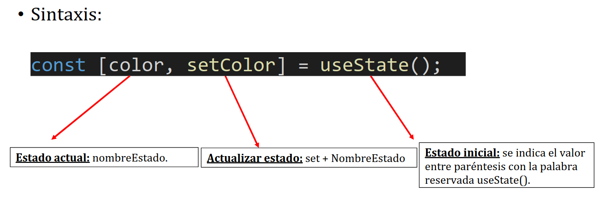

## React Native

### Eventos React

React Native funciona mediante la orientación de eventos, es decir que se modifican mediante eventos y no mediante objetos.  
Manejadores de eventos "handler": función que maneja el evento.  
La sintaxis en general de react-native consiste en camelCase.

```javascript
onNombreEvento();
```

Para que la aplicación reaccione a un evento, es necesario asociarle una lógica que se ejecutará cuando se produzca el evento → Manejadores de eventos.

```javascript
handlerOnPress();
```

Ejemplo de handlerOnPress() detallado:

```javascript
export default function App() {
  function handleOnPress() {
    alert("Hola");
  }
  return (
    <View style={styles.container}>
      <Pressable onPress={handleOnPress}>
        <Text style={styles.text}>Púlsame!</Text>
      </Pressable>
    </View>
  );
}
```

### Hooks React

Utilidades ya implementadas en el propio React sin las cuales no es posible hacer ciertas acciones.

En React Native no actualizamos las variables propias de un componente, lo que hacemos es actualizar su estado.

```javascript
import { View, Pressable, Text, StyleSheet } from "react-native";
import { useState } from "react";
export default function App() {
  const [color, setColor] = useState("yellow");
  function handleOnPress() {
    setColor("green");
    alert("Ahora sí que va");
  }
  return (
    <View style={[styles.container, { backgroundColor: color }]}>
      <Pressable onPress={handleOnPress}>
        <Text style={styles.text}>Púlsame!</Text>
      </Pressable>
    </View>
  );
}
```

A continuación se muestra una vista previa de la sintaxis de `useState`:



### Ejercicios Actividad 03 - onPress / onChangeText 26-09-25

```javascript
/// ejercicio 1
import { Text, TextInput, View, StyleSheet } from "react-native";
import { useState } from "react";
export default function Ejec1() {
  //constantes
  const [textos, setTextos] = useState({
    texto1: "yepa",
    texto2: "yepa",
    texto3: "yepa",
    texto4: "yepa",
  });

  function handleOnPress(clave) {
    setTextos((prevTextos) => {
      const newTextos = {
        texto1: prevTextos.texto1,
        texto2: prevTextos.texto2,
        texto3: prevTextos.texto3,
        texto4: prevTextos.texto4,
      };
      newTextos[clave] = prevTextos[clave] === "yepa" ? "wenas" : "yepa";
      return newTextos;
    });
  }

  return (
    <View style={styles.container}>
      <Text onPress={() => handleOnPress("texto1")} style={styles.text}>
        {textos.texto1}
      </Text>
      <Text onPress={() => handleOnPress("texto2")} style={styles.text}>
        {textos.texto2}
      </Text>
      <Text onPress={() => handleOnPress("texto3")} style={styles.text}>
        {textos.texto3}
      </Text>
      <Text onPress={() => handleOnPress("texto4")} style={styles.text}>
        {textos.texto4}
      </Text>
    </View>
  );
}
const styles = StyleSheet.create({
  container: {
    flex: 1,
    backgroundColor: "white",
    alignItems: "center",
    justifyContent: "center",
  },
  text: {
    fontSize: 30,
    marginBottom: 20,
  },
});
```

```javascript
///ejercicio 2
import { Text, Pressable, Image, View, StyleSheet } from "react-native";
import { useState } from "react";
// Imports de las fotos
import correctPhoto from "../assets/co.png";
import wrongPhoto from "../assets/wrong.png";

export default function Ejec2() {
  const [figura, setFigura] = useState({
    figura1: {
      texto: "correct",
      imagen: correctPhoto,
    },
    figura2: {
      texto: "correct",
      imagen: correctPhoto,
    },
  });

  function handleOnPress(clave) {
    setFigura((prevFiguras) => {
      const nuevaFiguras = {
        figura1: {
          texto: prevFiguras.figura1.texto,
          imagen: prevFiguras.figura1.imagen,
        },
        figura2: {
          texto: prevFiguras.figura2.texto,
          imagen: prevFiguras.figura2.imagen,
        },
      };

      if (nuevaFiguras[clave].texto === "correct") {
        nuevaFiguras[clave] = {
          texto: "wrong",
          imagen: wrongPhoto,
        };
      } else {
        nuevaFiguras[clave] = {
          texto: "correct",
          imagen: correctPhoto,
        };
      }

      return nuevaFiguras;
    });
  }

  return (
    <View style={styles.containerRow}>
      <Pressable onPress={() => handleOnPress("figura1")}>
        <Image style={styles.image} source={figura.figura1.imagen} />
        <Text>{figura.figura1.texto}</Text>
      </Pressable>
      <Pressable onPress={() => handleOnPress("figura2")}>
        <Image style={styles.image} source={figura.figura2.imagen} />
        <Text>{figura.figura2.texto}</Text>
      </Pressable>
    </View>
  );
}

const styles = StyleSheet.create({
  containerRow: {
    flex: 1,
    backgroundColor: "white",
    alignItems: "center",
    justifyContent: "center",
    flexDirection: "row",
  },
  image: {
    width: 100,
    height: 100,
  },
});
```

```javascript
///ejercicio 3
import { Pressable, View, StyleSheet } from "react-native";
import { useState } from "react";

export default function Ejec3() {
  const [cuadrao, setCuadrao] = useState({
    color: "yellow",
    width: 200,
  });

  function handleOnPress() {
    setCuadrao((prevCuadrao) => {
      if (prevCuadrao.color === "yellow") {
        return {
          color: "green",
          width: 300,
        };
      } else {
        return {
          color: "yellow",
          width: 200,
        };
      }
    });
  }

  return (
    <View style={styles.container}>
      <Pressable
        onPress={handleOnPress}
        style={[
          styles.square,
          {
            backgroundColor: cuadrao.color,
            width: cuadrao.width,
            height: cuadrao.width,
          },
        ]}
      />
      <Pressable
        onPress={handleOnPress}
        style={[
          styles.square,
          {
            backgroundColor: cuadrao.color,
            width: cuadrao.width,
            height: cuadrao.width,
          },
        ]}
      />
    </View>
  );
}
const styles = StyleSheet.create({
  container: {
    flex: 1,
    backgroundColor: "white",
    alignItems: "center",
    justifyContent: "center",
  },
  square: {
    marginTop: -6,
    width: 200,
    height: 200,
    backgroundColor: "yellow",
  },
});
```

```javascript
///ejercicio 4
import {
  Text,
  TextInput,
  Pressable,
  Image,
  View,
  StyleSheet,
} from "react-native";
import { useState } from "react";

export default function Ejec4() {
  //constantes
  const [text, setText] = useState("");

  function handleOnPress() {
    if (text === "" || text === null) {
      alert("no se ha introducido nada");
    } else if (!isNaN(text)) {
      alert("se ha introducido el digito: " + text);
    } else {
      alert("se ha introducido el texto: " + text);
    }
    setText("");
  }

  return (
    <View style={styles.container}>
      <TextInput
        style={{ height: 40 }}
        placeholder="Inserta tu texto..."
        onChangeText={(newText) => setText(newText)}
        defaultValue={text}
      />

      <Pressable onPress={handleOnPress}>
        <Text>Botón</Text>
      </Pressable>
    </View>
  );
}

const styles = StyleSheet.create({
  container: {
    flex: 1,
    backgroundColor: "white",
    alignItems: "center",
    justifyContent: "center",
  },
});
```

```javascript
///ejercicio 5
import {
  Text,
  TextInput,
  Pressable,
  Image,
  View,
  StyleSheet,
} from "react-native";
import { useState } from "react";

export default function Ejec5() {
  //constantes
  const [text, setText] = useState("");
  const [unidades, setUnidades] = useState("");

  function handleOnPress() {
    if (text === "" || text === null) {
      alert("no se ha introducido nada");
    } else if (!isNaN(text)) {
      setUnidades(calcularMillas(text));
    } else {
      alert("se ha introducido texto (parametro no permitido)");
    }
    setText("");
  }

  function calcularMillas(km) {
    return km * 0.62137;
  }

  return (
    <View style={styles.container}>
      <Text style={({ height: 70 }, { fontSize: 25 })}>
        Conversor de KM a Millas
      </Text>
      <TextInput
        style={{ height: 40 }}
        placeholder="Inserta los digitos..."
        onChangeText={(newText) => setText(newText)}
        value={text}
      />

      <Text>{unidades + " Millas"}</Text>

      <Pressable onPress={handleOnPress}>
        <Text>Transformar</Text>
      </Pressable>
    </View>
  );
}

const styles = StyleSheet.create({
  container: {
    flex: 1,
    backgroundColor: "white",
    alignItems: "center",
    justifyContent: "center",
  },
});
```

```javascript
///ejercicio 6
import {
  Text,
  TextInput,
  Pressable,
  Image,
  View,
  StyleSheet,
} from "react-native";
import { useState } from "react";

export default function Ejec6() {
  //constantes
  const [text, setText] = useState("");
  const [unidades, setUnidades] = useState("");

  function handleOnPress() {
    if (text === "" || text === null) {
      alert("no se ha introducido nada");
    } else if (!isNaN(text)) {
      setUnidades(calcularDolares(text));
    } else {
      alert("se ha introducido texto (parametro no permitido)");
    }
    setText("");
  }

  function calcularDolares(euro) {
    return euro * 1.17;
  }

  return (
    <View style={styles.container}>
      <Text style={({ height: 70 }, { fontSize: 25 })}>Conversor € - $</Text>
      <TextInput
        style={{ height: 40 }}
        placeholder="Inserta los digitos..."
        onChangeText={(newText) => setText(newText)}
        value={text}
      />

      <Text>{unidades + " $"}</Text>

      <Pressable onPress={handleOnPress}>
        <Text>Transformar</Text>
      </Pressable>
    </View>
  );
}

const styles = StyleSheet.create({
  container: {
    flex: 1,
    backgroundColor: "white",
    alignItems: "center",
    justifyContent: "center",
  },
});
```

```javascript
///ejercicio 7
import {
  Text,
  TextInput,
  Pressable,
  Image,
  View,
  StyleSheet,
} from "react-native";
import { useState } from "react";

export default function Ejec7() {
  //constantes
  const [text, setText] = useState("");

  function handleOnPress() {
    if (text === "" || text === null) {
      alert("no se ha introducido nada");
    } else {
      return calcularDNI(text)
        ? alert("dni bien puesto")
        : alert("dni mal puesto");
    }
    setText("");
  }

  function calcularDNI(dni) {
    const letras = [
      "T",
      "R",
      "W",
      "A",
      "G",
      "M",
      "Y",
      "F",
      "P",
      "D",
      "X",
      "B",
      "N",
      "J",
      "Z",
      "S",
      "Q",
      "V",
      "H",
      "L",
      "C",
      "K",
      "E",
    ];

    dniNoLetter = dni.slice(0, -1);
    let dniOrigin = dni.split("");
    let letraOriginal = dniOrigin.pop();

    let resto = dniNoLetter % 23;
    let letra = letras[resto];

    return letra === letraOriginal ? true : false;
  }

  return (
    <View style={styles.container}>
      <Text style={({ height: 70 }, { fontSize: 25 })}>Validador DNI</Text>
      <TextInput
        style={{ height: 40 }}
        placeholder="Inserta tu DNI"
        onChangeText={(newText) => setText(newText)}
        value={text}
      />

      <Pressable onPress={handleOnPress}>
        <Text>Validar</Text>
      </Pressable>
    </View>
  );
}

const styles = StyleSheet.create({
  container: {
    flex: 1,
    backgroundColor: "white",
    alignItems: "center",
    justifyContent: "center",
  },
});
```
