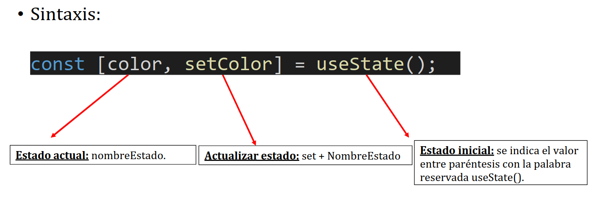

## React Native

### Eventos React

React Native funciona mediante la orientación de eventos, es decir que se modifican mediante eventos y no mediante objetos.  
Manejadores de eventos "handler": función que maneja el evento.  
La sintaxis en general de react-native consiste en camelCase.

```javascript
onNombreEvento();
```

Para que la aplicación reaccione a un evento, es necesario asociarle una lógica que se ejecutará cuando se produzca el evento → Manejadores de eventos.

```javascript
handlerOnPress();
```

Ejemplo de handlerOnPress() detallado:

```javascript
export default function App() {
  function handleOnPress() {
    alert("Hola");
  }
  return (
    <View style={styles.container}>
      <Pressable onPress={handleOnPress}>
        <Text style={styles.text}>Púlsame!</Text>
      </Pressable>
    </View>
  );
}
```

### Hooks React

Utilidades ya implementadas en el propio React sin las cuales no es posible hacer ciertas acciones.

En React Native no actualizamos las variables propias de un componente, lo que hacemos es actualizar su estado.

```javascript
import { View, Pressable, Text, StyleSheet } from "react-native";
import { useState } from "react";
export default function App() {
  const [color, setColor] = useState("yellow");
  function handleOnPress() {
    setColor("green");
    alert("Ahora sí que va");
  }
  return (
    <View style={[styles.container, { backgroundColor: color }]}>
      <Pressable onPress={handleOnPress}>
        <Text style={styles.text}>Púlsame!</Text>
      </Pressable>
    </View>
  );
}
```

A continuación se muestra una vista previa de la sintaxis de `useState`:



### Ejercicios Actividad 03 - onPress / onChangeText 26-09-25

```javascript
/// ejercicio 1
/*Sin emplear arrays en los estados y utilizando una única función para
manejar los cuatro eventos, implementa las instrucciones necesarias para
que cuando el usuario pulse sobre cualquier componente Text, se cambie el
texto contenido en ese componente. Si vuelve a pulsar sobre el mismo
componente, volverá al valor inicial. Si vuelve a pulsar, se volverá a cambiar.
Y así sucesivamente.*/
import { Text, TextInput, View, StyleSheet } from "react-native";
import { useState } from "react";
export default function Ejec1() {
  //constantes
  //creamos una constante en el que cada texto es individual pero tienen el mismo resultado
  //y nos aseguramos que se pueden setear
  const [textos, setTextos] = useState({
    texto1: "yepa",
    texto2: "yepa",
    texto3: "yepa",
    texto4: "yepa",
  });

  //con una unica función queremos que se haga un setTextos, donde lo que le pasamos el es key o clave, de manera que sabe sin ejemplar un array, que queremos que cambie
  //le decimos que el elemento prevTextos, se va a hacer una constante temporal, que va a heredar todo lo que los textos previos tenian en memoria
  //y si el indice de textos nuevos y textos previos coincide, estos cambian a 'yepa' o 'wenas' y retorna los nuevos textos
  function handleOnPress(clave) {
    setTextos((prevTextos) => {
      const newTextos = {
        texto1: prevTextos.texto1,
        texto2: prevTextos.texto2,
        texto3: prevTextos.texto3,
        texto4: prevTextos.texto4,
      };
      newTextos[clave] = prevTextos[clave] === "yepa" ? "wenas" : "yepa";
      return newTextos;
    });
  }

  //cada etiqueta texto hace un display de los textos individuales
  return (
    <View style={styles.container}>
      <Text onPress={() => handleOnPress("texto1")} style={styles.text}>
        {textos.texto1} 
      </Text>
      <Text onPress={() => handleOnPress("texto2")} style={styles.text}>
        {textos.texto2}
      </Text>
      <Text onPress={() => handleOnPress("texto3")} style={styles.text}>
        {textos.texto3}
      </Text>
      <Text onPress={() => handleOnPress("texto4")} style={styles.text}>
        {textos.texto4}
      </Text>
    </View>
  );
}
//no se cambian los estilos
const styles = StyleSheet.create({
  container: {
    flex: 1,
    backgroundColor: "white",
    alignItems: "center",
    justifyContent: "center",
  },
  text: {
    fontSize: 30,
    marginBottom: 20,
  },
});
```

```javascript
///ejercicio 2
/*Sin emplear arrays en los estados y utilizando una única función para
manejar los dos eventos, implementa las instrucciones necesarias para que
cuando el usuario pulse sobre el componente Image, se cambie la imagen
de ese componente y el texto del componente Text ubicado debajo. Si
vuelve a pulsar sobre el mismo componente, ambos componentes –Image y
Text-, volverán al valor inicial. Si vuelve a pulsar, se volverán a cambiar. Y así
sucesivamente. NOTA: implementa a cada componente Image una foto de
tu elección.*/
import { Text, Pressable, Image, View, StyleSheet } from "react-native";
import { useState } from "react";
// Imports de las fotos
import correctPhoto from "../assets/co.png";
import wrongPhoto from "../assets/wrong.png";

export default function Ejec2() {
  //aqui la clave fue que sabiendo que useState puede formar objetos o por lo menos usarlos, hacer una constante de figura y su set
  //en vez de crear 2 textos y 2 imagenes o inclusive 4 constantes, creamos una constante que tiene 2 objetos figuras con sus correspondidos textos e imagenes
  const [figura, setFigura] = useState({
    figura1: {
      texto: "correct",
      imagen: correctPhoto,
    },
    figura2: {
      texto: "correct",
      imagen: correctPhoto,
    },
  });

  //en una unica función, vamos a pasar por parametro hardcoded la clave, para identificar que se esta pulsando dentro de la aplicacion
  //se crea una nueva constante que son 2 objetos, que van a agarrar las propiedades de las figuras previas y sus estados
  //entonces si la nuevaFigura[su clave o figura1].texto es de una menra, se cambia solo la nuevaFigura que hayamos especificado, se renderiza su cambio de texto y su cambio de imagen, haciendo que esten ya en memoria
  //y se retorna el objeto, no un array, todo en una unica función
  function handleOnPress(clave) {
    setFigura((prevFiguras) => {
      const nuevaFiguras = {
        figura1: {
          texto: prevFiguras.figura1.texto,
          imagen: prevFiguras.figura1.imagen,
        },
        figura2: {
          texto: prevFiguras.figura2.texto,
          imagen: prevFiguras.figura2.imagen,
        },
      };

      if (nuevaFiguras[clave].texto === "correct") {
        nuevaFiguras[clave] = {
          texto: "wrong",
          imagen: wrongPhoto,
        };
      } else {
        nuevaFiguras[clave] = {
          texto: "correct",
          imagen: correctPhoto,
        };
      }

      return nuevaFiguras;
    });
  }

  //en los pressables, aparte de pasar la clave por el onPress(), renderizamos desde el objeto figura, su figura.imagen y su figura.texto
  //sin ejemplar arrays
  return (
    <View style={styles.containerRow}>
      <Pressable onPress={() => handleOnPress("figura1")}>
        <Image style={styles.image} source={figura.figura1.imagen} />
        <Text>{figura.figura1.texto}</Text>
      </Pressable>
      <Pressable onPress={() => handleOnPress("figura2")}>
        <Image style={styles.image} source={figura.figura2.imagen} />
        <Text>{figura.figura2.texto}</Text>
      </Pressable>
    </View>
  );
}

//no se cambian
const styles = StyleSheet.create({
  containerRow: {
    flex: 1,
    backgroundColor: "white",
    alignItems: "center",
    justifyContent: "center",
    flexDirection: "row",
  },
  image: {
    width: 100,
    height: 100,
  },
});
```

```javascript
///ejercicio 3
/*Sin emplear arrays en los estados y utilizando una única función para
manejar los dos eventos, implementa las instrucciones necesarias para que
cuando el usuario pulse sobre el cuadrado superior, los dos cuadrados sean
de color verde y se aumente su tamaño –de ambos-. Si el usuario pulsa
sobre el cuadrado superior, ambos serán de color amarillo y disminuirán su
tamaño.*/
//!!!! este era confuso, porque hay 2 cuadrados superpuestos uno encima del otro y los dos deben de cambiar
import { Pressable, View, StyleSheet } from "react-native";
import { useState } from "react";

export default function Ejec3() {
  //se coge una constante para poner el color y el tamaño, como soy vago simplemente le dije que cogiera width para luego tambien poner height pero con poner "tamaño" hubiera tirado bien
  const [cuadrao, setCuadrao] = useState({
    color: "yellow",
    width: 200,
  });

  //en una sola funcion, y sin pasarle nada por parametro
  //decimos que si el color previo del cuadrado es amarillo que retorne el color a verde y el tamaño +100 de lo que ya estaba y si no que lo devuelva a su estado original
  function handleOnPress() {
    setCuadrao((prevCuadrao) => {
      if (prevCuadrao.color === "yellow") {
        return {
          color: "green",
          width: 300,
        };
      } else {
        return {
          color: "yellow",
          width: 200,
        };
      }
    });
  }

  //como ambos cuadrados tienen que cambiar, no hace ninguna falta saber cual es cual, o que se renderizen cada uno, asi que si pulsamos queremos que cambien si o si los dos
  //en los estilos le tuve que decir que cogiera el color que estaba puesto de los cuadrados en la constante y el tamaño tambien, que cogiera el width y a correr
  return (
    <View style={styles.container}>
      <Pressable
        onPress={handleOnPress}
        style={[
          //justo aqui es donde le digo que coga las propiedades del cuadrado que se encuentran en la constante, debería de haber puesto tamaño
          styles.square,
          {
            backgroundColor: cuadrao.color,
            width: cuadrao.width,
            height: cuadrao.width,
          },
        ]}
      />
      <Pressable
        onPress={handleOnPress}
        style={[
          styles.square,
          {
            backgroundColor: cuadrao.color,
            width: cuadrao.width,
            height: cuadrao.width,
          },
        ]}
      />
    </View>
  );
}

//no se cambian 
const styles = StyleSheet.create({
  container: {
    flex: 1,
    backgroundColor: "white",
    alignItems: "center",
    justifyContent: "center",
  },
  square: {
    marginTop: -6,
    width: 200,
    height: 200,
    backgroundColor: "yellow",
  },
});
```

```javascript
///ejercicio 4
/*Implementa las instrucciones necesarias para renderizar en la interfaz
gráfica un componente TextInput que recoja el contenido que introduzca el
usuario, debajo, un componente Pressable. Implementa la lógica necesaria
para que cuando el usuario pulse el botón de Pressable, salte una alerta
indicando los siguientes casos: si se ha introducido texto, si se ha
introducido un número o si no se ha introducido nada.*/
import {
  Text,
  TextInput,
  Pressable,
  Image,
  View,
  StyleSheet,
} from "react-native";
import { useState } from "react";

export default function Ejec4() {
  //constantes
  //para poner solo el texto
  const [text, setText] = useState("");

  //la única función que hace falta
  //si el texto es nulo no se ha puesto nada, sino se comprueba si es numero o si es texto
  //isNaN significa is Not a Number, si no es numeral, si si que es numeral lo dice, sino es que es texto
  function handleOnPress() {
    if (text === "" || text === null) {
      alert("no se ha introducido nada");
    } else if (!isNaN(text)) {
      alert("se ha introducido el digito: " + text);
    } else {
      alert("se ha introducido el texto: " + text);
    }
    //y se limpia el texto
    setText("");
  }

  //aqui cogemos los ejemplos de código del profesor, usamos un placeholder para que haga un display dentro de donde vamos a poner texto, y le decimos que el texto que le estamos poniendo lo ponga dentro del placeholder, y que el default sea el texto que es "" puesto en le useState 
  //como es un solo boton con que le pasemos que hacer en onPress vamos bien
  return (
    <View style={styles.container}>
      <TextInput
        style={{ height: 40 }}
        placeholder="Inserta tu texto..."
        onChangeText={(newText) => setText(newText)}
        defaultValue={text}
      />

      <Pressable onPress={handleOnPress}>
        <Text>Botón</Text>
      </Pressable>
    </View>
  );
}

//no se cambia
const styles = StyleSheet.create({
  container: {
    flex: 1,
    backgroundColor: "white",
    alignItems: "center",
    justifyContent: "center",
  },
});
```

```javascript
///ejercicio 5
/*Implementa las instrucciones necesarias para renderizar en la interfaz
gráfica un convertidor de kilómetros a millas. Para ello, renderiza un
componente TextInput que recoja el contenido que introduzca el usuario, y,
debajo, un componente Pressable. Implementa la lógica necesaria para que
cuando el usuario pulse el botón de Pressable, se renderice debajo del
componente TextInput la cantidad de kilómetros introducida convertida a
millas. Si el usuario no introduce ningún dato, saltará una alerta indicándolo
y se borrará el contenido introducido en TextInput. Si introduce texto, se le
indicará que ha introducido texto y se borrará el contenido introducido en
TextInput.
Nota: 1 kilómetro son 0.62 millas.*/
import {
  Text,
  TextInput,
  Pressable,
  Image,
  View,
  StyleSheet,
} from "react-native";
import { useState } from "react";

export default function Ejec5() {
  //constantes tanto para el texto como para el display de las unidades
  const [text, setText] = useState("");
  const [unidades, setUnidades] = useState("");

  //función que al pulsar el botón se sabe si se ha introducido algo o no, si no se ha puesto nada salta una alerta.
  //si se ha introducido texto salta una alerta
  //si se ha introducido un numero este hace un setUnidades de la funcion calcularMillas y se le pasa el parametro del texto 
  function handleOnPress() {
    if (text === "" || text === null) {
      alert("no se ha introducido nada");
    } else if (!isNaN(text)) {
      setUnidades(calcularMillas(text));
    } else {
      alert("se ha introducido texto (parametro no permitido)");
    }
    setText("");
  }

  //funcion para calcular las millas, se le pasa el texto por parametro y se multiplica cada km por el valor de la milla
  function calcularMillas(km) {
    return km * 0.62137;
  }

  //aqui le ponemos un texto que haga un display del titulo con su altura dentro de la app y su fuente
  //y en el text input esta todo igual al anterior ejercicio, hace un placehorlder para saber que poner, se setea el texto con onChangeText pero para borrarlo se cambia defaultValue por value
  //en el text de unidades es donde las unidades seteadas se retornar y se ponen
  return (
    <View style={styles.container}>
      <Text style={({ height: 70 }, { fontSize: 25 })}>
        Conversor de KM a Millas
      </Text>
      <TextInput
        style={{ height: 40 }}
        placeholder="Inserta los digitos..."
        onChangeText={(newText) => setText(newText)}
        value={text}
      />
    
      <Text>{unidades + " Millas"}</Text>

      <Pressable onPress={handleOnPress}>
        <Text>Transformar</Text>
      </Pressable>
    </View>
  );
}

//no se cambia nada
const styles = StyleSheet.create({
  container: {
    flex: 1,
    backgroundColor: "white",
    alignItems: "center",
    justifyContent: "center",
  },
});
```

```javascript
///ejercicio 6
/*Siguiendo las instrucciones del ejercicio anterior, implementa ahora un
convertidor de euros a dólares.*/
//copia y pega del ejercicio anterior, pero se cambia la funcion para calcularDolares
//incluso la funcion para las unidades se queda igual
import {
  Text,
  TextInput,
  Pressable,
  Image,
  View,
  StyleSheet,
} from "react-native";
import { useState } from "react";

export default function Ejec6() {
  //constantes
  const [text, setText] = useState("");
  const [unidades, setUnidades] = useState("");

  function handleOnPress() {
    if (text === "" || text === null) {
      alert("no se ha introducido nada");
    } else if (!isNaN(text)) {
      setUnidades(calcularDolares(text));
    } else {
      alert("se ha introducido texto (parametro no permitido)");
    }
    setText("");
  }

  function calcularDolares(euro) {
    return euro * 1.17;
  }

  return (
    <View style={styles.container}>
      <Text style={({ height: 70 }, { fontSize: 25 })}>Conversor € - $</Text>
      <TextInput
        style={{ height: 40 }}
        placeholder="Inserta los digitos..."
        onChangeText={(newText) => setText(newText)}
        value={text}
      />

      <Text>{unidades + " $"}</Text>

      <Pressable onPress={handleOnPress}>
        <Text>Transformar</Text>
      </Pressable>
    </View>
  );
}

const styles = StyleSheet.create({
  container: {
    flex: 1,
    backgroundColor: "white",
    alignItems: "center",
    justifyContent: "center",
  },
});
```

```javascript
///ejercicio 7
/*Siguiendo las instrucciones del ejercicio anterior, implementa ahora con la
ayuda de los componentes TextInput y Pressable un validador de DNI. Nota:
ten en cuenta que el DNI tendrá que estar formado por 8 números y una
letra, cualquier otra combinación, no será válida y se indicará mediante una
alerta al usuario.*/
import {
  Text,
  TextInput,
  Pressable,
  Image,
  View,
  StyleSheet,
} from "react-native";
import { useState } from "react";

export default function Ejec7() {
  //constantes solo para el texto no necesitamos nada mas
  const [text, setText] = useState("");

  //cuando se pulsa el boton comprobamos si el texto esta vacio, en caso de que no le pedimos que use calcularDNI pasandole por parametro el texto del TextInput, en caso de que calcularDNI sea true dice que el dni esta bien, en caso false esta mal
  function handleOnPress() {
    if (text === "" || text === null) {
      alert("no se ha introducido nada");
    } else {
      return calcularDNI(text)
        ? alert("dni bien puesto")
        : alert("dni mal puesto");
    }
    setText("");
  }

  //funcion que se le pasa el texto por parametro, llamado dni, la constante de las letras es para saber que letras son las que se usan para calcular el dni
  function calcularDNI(dni) {
    const letras = [
      "T",
      "R",
      "W",
      "A",
      "G",
      "M",
      "Y",
      "F",
      "P",
      "D",
      "X",
      "B",
      "N",
      "J",
      "Z",
      "S",
      "Q",
      "V",
      "H",
      "L",
      "C",
      "K",
      "E",
    ];

    //quitamos el ultimo elemento del dni, que es la letra
    dniNoLetter = dni.slice(0, -1);
    //convertimos una copia del string dni en un array de numeros
    let dniOrigin = dni.split("");
    //para poder usar .pop() y quitarle solo la letra al dni que hemos pasado por el TextInput, este bien o mal puesto
    let letraOriginal = dniOrigin.pop();

    //se calcula el resto dividiendo el dni entre 23
    let resto = dniNoLetter % 23;
    //dentro del array de letras seleccionamos el indice que hemos sacado del resto
    let letra = letras[resto];

    //en caso de que las letras coincidan sera true, caso negativo sera false
    return letra === letraOriginal ? true : false;
  }

  //exactamente igual que el anterior pero solo saca una alerta si es true o false
  return (
    <View style={styles.container}>
      <Text style={({ height: 70 }, { fontSize: 25 })}>Validador DNI</Text>
      <TextInput
        style={{ height: 40 }}
        placeholder="Inserta tu DNI"
        onChangeText={(newText) => setText(newText)}
        value={text}
      />

      <Pressable onPress={handleOnPress}>
        <Text>Validar</Text>
      </Pressable>
    </View>
  );
}

//no se cambia nada
const styles = StyleSheet.create({
  container: {
    flex: 1,
    backgroundColor: "white",
    alignItems: "center",
    justifyContent: "center",
  },
});
```
