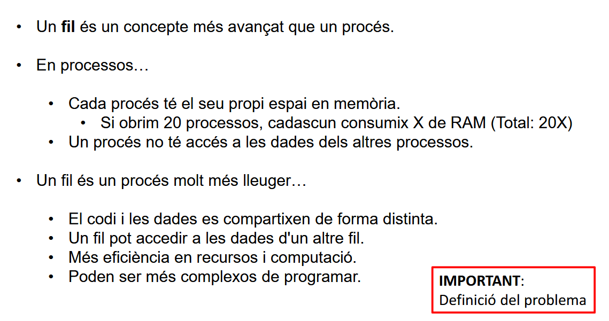
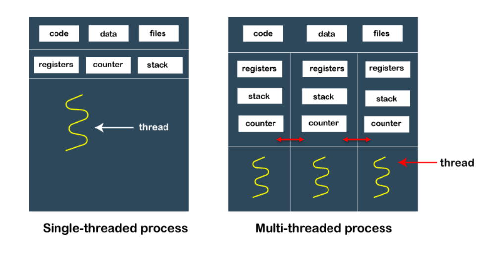
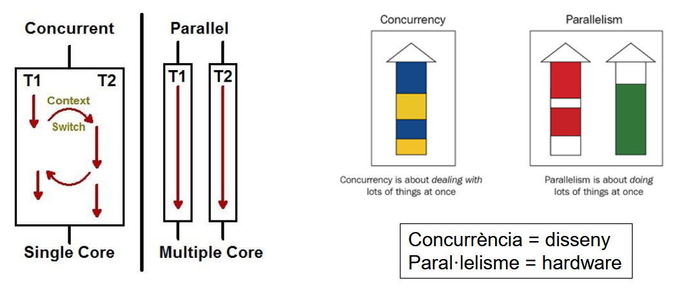
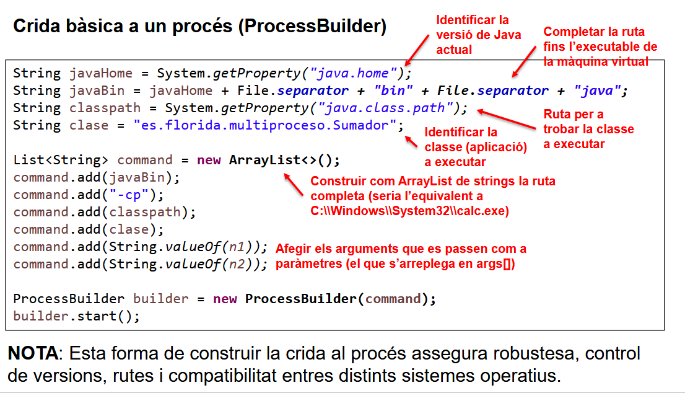

## Apuntes Tema 2

### Teoría

#### Hilos

> Explicación visual de cómo funcionan los hilos

#### Estructura Visual de Hilos

> Representación gráfica de la estructura de hilos

#### Concurrencia vs Paralelismo

> Diferencias entre concurrencia y paralelismo

---

### ProcessBuilder

#### Ejemplo de Uso



Ejemplo de uso de ProcessBuilder en Java:
```java
public class LlanzadorProcessos {
    public void executar(String ruta){ //ruta por parametro
        ProcessBuilder pb; //creador de procesos
        try {
            pb = new ProcessBuilder(ruta);
            pb.start(); //ejecutar
        } catch (Exception e) {
            e.printStackTrace();
        }
    }
    public static void main(String[] args) {
        String ruta = "C:\\Windows\\System32\\calc.exe"; //ruta de lo que queremos que se ejecute
        LlanzadorProcessos lp = new LlanzadorProcessos(); //nueva clase lanzador
        lp.executar(ruta); //que utiliza el metodo de ejecutar, ejecuta la ruta
        System.out.println("Finalitzat");
    }
}
```

### Bloque 2 Tareas 1

```java
/*ejec 1 - Realitza un programa Sumador1 en Java que donats dos números enters, torne per pantalla
la suma de tots els números que hi ha entre ells (incloent-los).*/
package Bloque2Tareas1;

public class Sumador1 {
    //funcion para sumar desde num1 hasta num2; de 0 a 10 son 55
    public static int suma(int num1, int num2) {
        int res = 0;
        for (int i = num1; i <= num2; i++) {
            res += i;
        }
        return res;
    }
    //main de argumentos que coge 2 numeros pasador por parametros, los transforma a integer y ejecuta la suma
    public static void main(String [] args){
        int num1 = Integer.parseInt(args[0]);
        int num2 = Integer.parseInt(args[1]);
        System.out.println(suma(num1,num2));
    }
}
```

```java
/*ejec 2 - Realitza un programa Lanzador1 en Java que cride al programa anterior a través d'una crida
de sistema, és a dir, creant un procés nou amb ProcessBuilder.*/
package Bloque2Tareas1;

import java.io.File;
import java.util.ArrayList;
import java.util.List;

public class Lanzador1 {
    public static void ejecutar(int num1, int num2) {
        try {
            String javaHome = System.getProperty("java.home"); //identificar version de java
            String javaBin = javaHome + File.separator + "bin" + File.separator + "java"; //donde se encuentra la maquina virtual
            String classpath = System.getProperty("java.class.path"); //ruta para saber que ejecutar
            String clase = "Bloque2Tareas1.Sumador1"; //la clase a ejecutar
            List<String> command = new ArrayList<>(); //la ruta completa
            command.add(javaBin);
            command.add("-cp");
            command.add(classpath);
            command.add(clase);
            command.add(String.valueOf(num1)); //argumento 1
            command.add(String.valueOf(num2)); //argumento 2
            ProcessBuilder builder = new ProcessBuilder(command); //el creador de procesos
            //builder.start();
            builder.inheritIO().start(); //que se muestre por consola las consolas de sumador1
        } catch (Exception e) {
            e.printStackTrace();
        }
    }

    public static void main(String[] args) {
        ejecutar(1, 50); //sumador1
        ejecutar(50, 100); //sumador1
    }
}
```

```java
/*ejec 3 - Crea una versió del Sumador1 (que s’anomenarà Sumador2) que, a més de sumar, escriga
el resultat en un fitxer en disc (pots posar-li el nom que vulgues al fitxer.*/
package Bloque2Tareas1;

import java.io.*;

public class Sumador2 {
    //funcion de suma no se toca (no hace falta)
    public static int suma(int num1, int num2) {
        int res = 0;
        for (int i = num1; i <= num2; i++) {
            res += i;
        }
        return res;
    }

    //
    public static void main(String [] args){
        int num1 = Integer.parseInt(args[0]); //argumento1
        int num2 = Integer.parseInt(args[1]); //argumento2
        Integer resultado = suma(num1, num2); //resultado de la suma de los elementos
        String fichero = args[2]; //el fichero que le pasamos por parametro
        try {
            File f = new File(fichero); //manejador de archivo
            FileWriter fw = new FileWriter(fichero); //para poder escribir los caracteres
            f.createNewFile(); //se crea el archivo
            fw.write(String.valueOf(resultado)); //se escribe el resultado en forma de string porque si no escribe los caracteres ASCII
            fw.close(); //se cierra
        } catch (Exception e) {
            e.printStackTrace();
        }
        System.out.println("Resultado: " + resultado); //imprimir por pantalla el resultado para ver si coinciden
    }
}
```

```java
/*ejec 4 - Crear una versió del Lanzador1 (que s’anomenarà Lanzador2), que llance l’aplicació
Sumador2 com a procés i que a més llija el resultat que ha escrit Sumador2 i el mostre per
pantalla (en la consola de Lanzador2). Haurà d’implementar algun procediment per a
controlar que el fitxer estiga efectivament escrit i el seu contingut disponible.*/
package Bloque2Tareas1;

import java.io.File;
import java.util.ArrayList;
import java.util.List;

public class Lanzador2 {
    public static void ejecutar(int num1, int num2, String fichero) {
        try {
            String javaHome = System.getProperty("java.home");
            String javaBin = javaHome + File.separator + "bin" + File.separator + "java";
            String classpath = System.getProperty("java.class.path");
            String clase = "Bloque2Tareas1.Sumador2"; //ejecuta el sumador2 en vez del sumador1
            List<String> command = new ArrayList<>();
            command.add(javaBin);
            command.add("-cp");
            command.add(classpath);
            command.add(clase);
            command.add(String.valueOf(num1));
            command.add(String.valueOf(num2));
            command.add(fichero); //le pasamos tambien el fichero
            ProcessBuilder builder = new ProcessBuilder(command);
            builder.start(); //para no mostrar nada por pantalla
            //builder.inheritIO().start();
            //builder.redirectOutput(new File(fichero));
        } catch (Exception e) {
            e.printStackTrace();
        }
    }

    public static void main(String[] args) {
        ejecutar(1, 50, "resultado1.txt"); //los parametros para sumador2, los numeros y el nombre del fichero donde lo va a escribir
        ejecutar(50, 100, "resultado2.txt"); //** igual
    }
}
```

```java
/*ejec 5 - Crea altra versió del Lanzador2 (que s’anomenarà Lanzador3) que cride dues vegades
consecutives a Sumador2, llija els resultats dels fitxers generats i els mostre per pantalla (en
la consola de Lanzador3).*/
//exactamente igual al anterior
package Bloque2Tareas1;

import java.io.File;
import java.util.ArrayList;
import java.util.List;

public class Lanzador3 {
    public static void ejecutar(int num1, int num2, String fichero) {
        try {
            String javaHome = System.getProperty("java.home");
            String javaBin = javaHome + File.separator + "bin" + File.separator + "java";
            String classpath = System.getProperty("java.class.path");
            String clase = "Bloque2Tareas1.Sumador2";
            List<String> command = new ArrayList<>();
            command.add(javaBin);
            command.add("-cp");
            command.add(classpath);
            command.add(clase);
            command.add(String.valueOf(num1));
            command.add(String.valueOf(num2));
            command.add(fichero);
            ProcessBuilder builder = new ProcessBuilder(command);
            //builder.start();
            builder.inheritIO().start(); //para mostrar las consolas por pantalla aparte de tener el resultado en los ficheros
            //builder.redirectOutput(new File(fichero));
        } catch (Exception e) {
            e.printStackTrace();
        }
    }

    public static void main(String[] args) {
        ejecutar(1, 50, "resultado1.txt");
        ejecutar(50, 100, "resultado2.txt");
    }
}
```

```java
/*ejec 6 - Crea altra versió del Lanzador1 (que s’anomenarà Lanzador4) que redirigisca l’eixida de
l’execució del Sumador1 al seu fluxe d’execució (al fluxe de Lanzador4) i el mostre per
consola.*/
//igual que el anterior
package Bloque2Tareas1;

import java.io.File;
import java.util.ArrayList;
import java.util.List;

public class Lanzador4 {
    public static void ejecutar(int num1, int num2) {
        try {
            String javaHome = System.getProperty("java.home");
            String javaBin = javaHome + File.separator + "bin" + File.separator + "java";
            String classpath = System.getProperty("java.class.path");
            String clase = "Bloque2Tareas1.Sumador1"; //cambiamos la clase a ejecutar, siendo sumador1
            List<String> command = new ArrayList<>();
            command.add(javaBin);
            command.add("-cp");
            command.add(classpath);
            command.add(clase);
            command.add(String.valueOf(num1));
            command.add(String.valueOf(num2));
            ProcessBuilder builder = new ProcessBuilder(command);
            //builder.start();
            builder.inheritIO().start(); //muestra las consolas de sumador1 en lanzador4
        } catch (Exception e) {
            e.printStackTrace();
        }
    }

    public static void main(String[] args) {
        ejecutar(1, 50); //al ser sumador1 este no escribe las cosas en un fichero, por tanto no se lo pasamos
        ejecutar(50, 100); //** igual
    }
}
```

```java
/*ejec 7 - Crear altra versió del Lanzador1 (que s’anomenarà Lanzador5) que redirigisca l’eixida de l
l’execució del Sumador1 al seu fluxe d’execució (al fluxe de Lanzador5) i l’escriga en un
fitxer.*/
package Bloque2Tareas1;

import java.io.File;
import java.util.ArrayList;
import java.util.List;

public class Lanzador5 {
    public static void ejecutar(int num1, int num2, String fichero) {
        try {
            String javaHome = System.getProperty("java.home");
            String javaBin = javaHome + File.separator + "bin" + File.separator + "java";
            String classpath = System.getProperty("java.class.path");
            String clase = "Bloque2Tareas1.Sumador1"; //sigue siendo sumador1
            List<String> command = new ArrayList<>();
            command.add(javaBin);
            command.add("-cp");
            command.add(classpath);
            command.add(clase);
            command.add(String.valueOf(num1));
            command.add(String.valueOf(num2));
            command.add(fichero);
            ProcessBuilder builder = new ProcessBuilder(command);
            //builder.start();
            //builder.inheritIO().start();
            builder.redirectOutput(new File(fichero)).start(); //en vez de hacer que se muestren, estos se escriben en los ficheros de resultado que le pasamos
        } catch (Exception e) {
            e.printStackTrace();
        }
    }

    public static void main(String[] args) {
        ejecutar(1, 50, "resultado1.txt"); //pasamos los parametros
        ejecutar(50, 100, "resultado2.txt");
    }
}
```